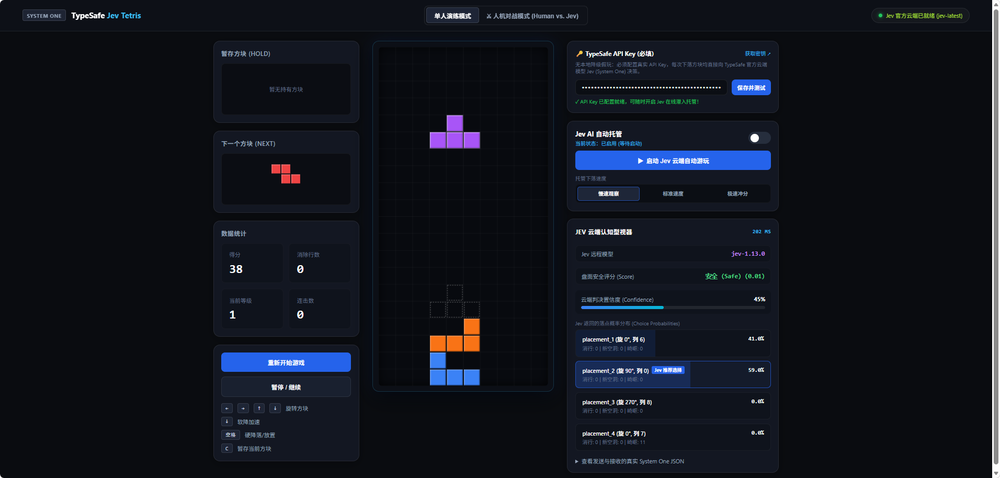
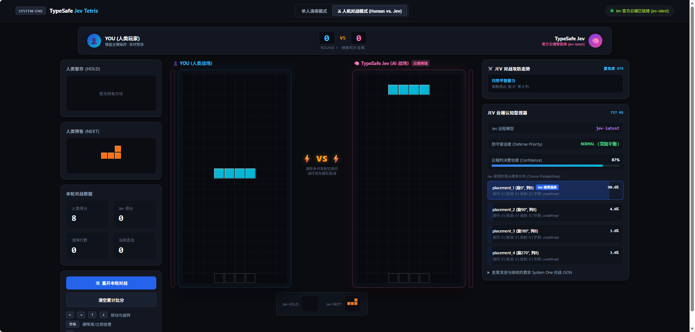

# TypeSafe Jev Tetris

[English](README.md) | [简体中文](README.zh-CN.md)

---

An adversarial real-time Tetris battle and autonomous player powered by [TypeSafe](https://docs.typesafe.ai)'s **Jev (System One)** model. Play head-to-head against Jev in **Human vs. Jev Battle Mode** with synchronous 7-bag RNG and real-time garbage row attacks, or observe Jev's split-second typed decisions and live telemetry in **Single-Player Practice Mode**.

This project demonstrates the **"Code in Control + System One Intelligence"** paradigm: deterministic board physics and candidate enumerations are executed in pure code, while Jev provides instant, programmable common-sense decisions under active gravity.

**Live Demo:** [https://tetri-jev.vercel.app](https://tetri-jev.vercel.app)

> ⚡ **Zero Local Mock**: Decisions are 100% powered by the live TypeSafe cloud Jev model. Requires a valid TypeSafe API Key.

---

## Screenshots

### 1. Single-Player Mode & Live Cognitive Telemetry

*Real-time AI auto-play displaying decision latency (~200ms), board safety score, confidence meter, candidate placement probabilities, and raw System One payload inspection.*

### 2. Human vs. Jev Real-Time Battle Mode

*Split-screen versus arena featuring identical 7-bag piece sequences, incoming garbage warnings, line-clear cancellation, and Jev's dynamic tactical defense/attack stance.*

---

## Key Features

- **Human vs. Jev Real-Time Versus (`⚔️ Battle Mode`)**:
  - **Synchronized 7-Bag RNG**: Both human and Jev receive the exact same sequence of tetrominoes for absolute competitive fairness.
  - **Garbage Row Attacks**:
    - Clear 2 lines (Double): Send **1 garbage row** to the opponent.
    - Clear 3 lines (Triple): Send **2 garbage rows** to the opponent.
    - Clear 4 lines (Tetris): Send **4 critical garbage rows**!
    - Combos: Consecutive clears ramp up additional penalty rows.
  - **Garbage Meter & Instant Counter-Offset**: Incoming garbage enters a danger buffer meter. Clearing lines before the current piece locks cancels pending rows, reflecting leftover damage back to the attacker.
  - **Dynamic Stance Adaptation**: Jev senses opponent stack height and pending incoming attacks—shifting seamlessly between emergency line-clear defense and Tetris-ready well hoarding.

- **Single-Player Practice & Autonomous Agent**:
  - Configurable auto-play speeds: *Relaxed Observation*, *Standard Speed*, and *Blitz Rush*.
  - Full keyboard control alongside AI assistance.

- **Real-Time Cognitive Telemetry**:
  - Split-second API roundtrip latency (typically 200–500 ms).
  - Choice probabilities across candidate placements (`placement_1`, `placement_2`, etc.).
  - Board safety evaluation and decision confidence percentage.
  - Expandable drawer to inspect raw System One JSON queries and responses.

- **Built-in Secure Proxy & Audit Trail**:
  - Node.js backend proxies requests to `api.typesafe.ai` with zero browser exposure of upstream secrets.
  - All decisions and latency benchmarks are logged to [`typesafe_audit.log`](file:///d:/my/tetri-jev/typesafe_audit.log).

---

## How It Works: Code in Control + System One

Traditional LLMs (ChatGPT, Claude, etc.) struggle in real-time arcade games due to high reasoning latency (1–3s) and unpredictable structured output. TypeSafe Jev solves this with a two-layer architecture:

```
+-------------------------------------------------------------+
|                     Game Engine (Code)                      |
|  - 10x20 Board Physics & Collision Detection               |
|  - Active Gravity & Lock Timers                             |
|  - Enumerate All Legal Placements (Rotations & Columns)     |
|  - Feature Extraction (Holes, Surface Bumpiness, Well Depth)|
+------------------------------+------------------------------+
                               |
                   Structured State & Candidates
                               |
                               v
+-------------------------------------------------------------+
|              TypeSafe Jev (System One Cloud)                |
|  - Typed Choice Questions (Best Placement Selection)        |
|  - Typed Score Questions (Danger & Board Safety Evaluation) |
|  - Returns: Selection, Probability Distribution, Confidence |
+-------------------------------------------------------------+
```

---

## Keyboard Controls (Human Player)

| Key | Action |
| :--- | :--- |
| **← / →** or **A / D** | Move piece Left / Right |
| **↑** or **W** | Rotate Clockwise |
| **↓** or **S** | Soft Drop |
| **Space** | Hard Drop (Instant lock) |
| **C** | Hold current piece |
| **P** | Pause / Resume |

---

## Quick Start
 
Try it live instantly at 👉 **[https://tetri-jev.vercel.app](https://tetri-jev.vercel.app)**, or run locally:

### Prerequisites
- Node.js 18+ installed.
- A TypeSafe API Key (obtain from [console.typesafe.ai/keys](https://console.typesafe.ai/keys)).

### 1. Clone & Setup
```bash
git clone https://github.com/pojianbing/tetri-jev.git
cd tetri-jev
```

### 2. Configure Environment (Optional)
You can set your API key in the environment or directly via the web interface:
```bash
# Windows PowerShell
$env:TYPESAFE_API_KEY="your-typesafe-api-key"

# Linux / macOS
export TYPESAFE_API_KEY="your-typesafe-api-key"
```

### 3. Start the Server
```bash
npm start
# or: node server.js
```
The server will start at:
👉 **[http://localhost:4000](http://localhost:4000)**

### 4. Play
1. Open [http://localhost:4000](http://localhost:4000) in your browser.
2. Enter and test your API key in the setup card (if not already set via environment).
3. Switch between **Single-Player Practice** and **Human vs. Jev Battle Mode** at the top.

---

## Automated Tests

The repository includes test suites verifying candidate evaluation, AI decision routing, garbage line mechanics, and long-term simulation:

```bash
npm test
```

This runs:
- `test/candidate-test.js`: Legal placement enumeration & heuristic feature sanity.
- `test/ai-test.js`: AI controller decision flow & timeout fallbacks.
- `test/battle-test.js`: Versus garbage calculation, buffering, and cancellation math.

---

## License

[MIT License](LICENSE)
